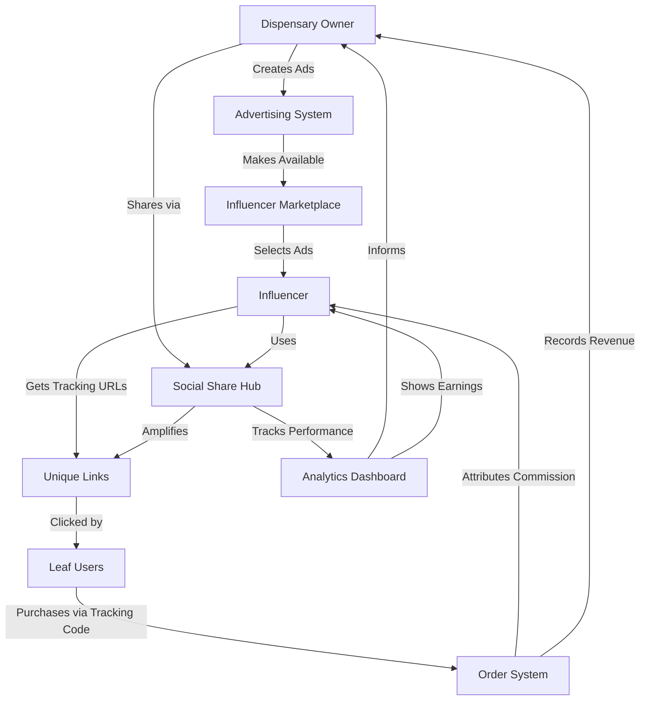

# Social Share Hub + Advertising + Influencer Integration Strategy

## 🎯 Executive Summary

This document outlines how **Social Share Hub**, **Advertising System**, and **Influencer Marketplace** work together to create a powerful ecosystem where dispensary owners can amplify their reach, influencers can promote products authentically, and leaf users benefit from targeted content.

---

## 🌟 Current System Overview

### 1. **Social Share Hub** (Dispensary Owner Tool)
**Location**: `/dispensary-admin/dashboard` → "Social Share Hub" button  
**Purpose**: Enable dispensaries to share their stores across social platforms  

**Features**:
- ✅ Share to 9 platforms (Facebook, Instagram, TikTok, WhatsApp, etc.)
- ✅ Custom share images per platform
- ✅ Scheduled sharing (future posts)
- ✅ Performance leaderboard (competitive rankings)
- ✅ Analytics & CSV export
- ✅ UTM tracking & QR codes
- ✅ Achievement system (gamification)

**Current Workflow**:
```
Dispensary Owner → Opens Social Share Hub → Selects Platform → Shares Store URL → Analytics Tracked
```

---

### 2. **Advertising System** (Dispensary Owner + Super Admin)
**Location**: 
- Dispensary Owner: `/dispensary-admin/advertising`
- Super Admin: `/admin/dashboard/advertising`

**Purpose**: Create targeted ads with product bundles that influencers can promote

**Features**:
- ✅ Ad creation wizard (5 steps)
- ✅ Product bundle pricing
- ✅ Influencer commission rates (15-25%)
- ✅ Unique tracking URLs per influencer
- ✅ Real-time analytics (impressions, clicks, conversions)
- ✅ Commission attribution
- ✅ Display components (AdBanner, FeaturedAdCard, SidebarAd)

**Current Workflows**:

**Dispensary Owner**:
```
Create Ad → Select Products → Set Bundle Price → Enable Influencer Availability → Set Commission Rate → Publish
```

**Influencer**:
```
Browse Marketplace → Select Ad → Get Unique Tracking URL (AD-123-INF-xyz) → Share on Social → Earn Commission
```

**Store Display**:
```
Store Page (/store/[dispensaryId]) → AdBanner (top) + FeaturedAdCard (products) + SidebarAd (sticky)
```

---

### 3. **Influencer System** (Influencer Tool)
**Location**: `/dashboard/influencer`

**Purpose**: Empower influencers to promote dispensary ads and earn commissions

**Features**:
- ✅ Ad marketplace with filtering
- ✅ Sort by commission rate
- ✅ Unique tracking code generation
- ✅ QR code for sharing
- ✅ Performance analytics (impressions, clicks, conversions, earnings)
- ✅ Tier system (Seed, Sprout, Growth, Bloom, Elite)

**Current Workflow**:
```
Influencer → Browse Marketplace → Select Ad → Get Tracking URL → Share on Social Media → Track Performance → Earn Commission
```

---

## 🔗 Integration Architecture

### **Current State: THREE SEPARATE SYSTEMS**
- ❌ Social Share Hub only shares store links (no ads)
- ❌ Influencers get tracking links but no Social Hub tools
- ❌ Advertising exists but isn't integrated into Social Hub workflow

### **Proposed Integration: UNIFIED ECOSYSTEM**



---

## 💡 Integration Strategy: THREE-TIER APPROACH

---

## 🔥 **TIER 1: Dispensary Owner Perspective**

### **Goal**: Enable dispensaries to share their ads (not just store links) via Social Hub

### **Implementation**:

#### **1.1 Add "Share My Ads" Tab to Social Share Hub**

**Location**: `src/components/social-share/SocialShareHub.tsx`

**New Tab**: `ads` (between `share` and `analytics`)

**Features**:
- Display all active ads for current dispensary
- Select which ad to share
- Generate unique share URL for that specific ad
- Show ad performance when shared socially
- Track social shares separately from direct ad impressions

**UI**:
```tsx
<TabsContent value="ads">
  <Card>
    <CardHeader>
      <CardTitle>Share Your Ads</CardTitle>
      <CardDescription>Promote your advertising campaigns across social platforms</CardDescription>
    </CardHeader>
    <CardContent>
      {/* Ad Grid */}
      <div className="grid grid-cols-1 md:grid-cols-2 gap-4">
        {myAds.map(ad => (
          <Card key={ad.id}>
            <CardHeader>
              <CardTitle>{ad.title}</CardTitle>
              <Badge>{ad.type}</Badge>
            </CardHeader>
            <CardContent>
              <p>{ad.description}</p>
              {ad.products && <Badge variant="secondary">{ad.products.length} Products</Badge>}
              <Button onClick={() => shareAd(ad)} className="mt-4">
                Share This Ad
              </Button>
            </CardContent>
          </Card>
        ))}
      </div>
    </CardContent>
  </Card>
</TabsContent>
```

#### **1.2 Social Share URL Format for Ads**

**Current** (Store): `https://app.com/dispensary/123`

**New** (Ad): `https://app.com/dispensary/123/ad/abc?utm_source=facebook&utm_medium=social&utm_campaign=summer_sale`

**Benefits**:
- Direct link to ad landing page
- UTM tracking shows which social platform drove traffic
- Attribution to dispensary owner's social efforts
- Can create dedicated ad landing pages

#### **1.3 Analytics Integration**

**Update Analytics Tab**:
- Show performance breakdown: **Store Shares** vs. **Ad Shares**
- Track which ads perform best on which platforms
- Calculate ROI: Social spend (time) vs. Ad conversions

---

## 🌟 **TIER 2: Influencer Perspective**

### **Goal**: Give influencers access to Social Hub tools for amplified promotion

### **Implementation**:

#### **2.1 Unlock Social Share Hub for Influencers**

**Current State**: Only dispensary owners see Social Share Hub

**New State**: Influencers get specialized version when they select an ad to promote

**Location**: `/dashboard/influencer/ad-marketplace/page.tsx`

**Flow**:
```tsx
Influencer → Selects Ad → Clicks "Promote This Ad" → Opens Influencer Social Share Modal
```

#### **2.2 Create "Influencer Social Share Modal"**

**New Component**: `src/components/influencer/InfluencerSocialShareModal.tsx`

**Features**:
- **Pre-populated content**:
  - Ad title
  - Ad description  
  - Product details
  - Custom influencer message
  - **Tracking URL** (unique to influencer)
  
- **Social Platform Grid** (same as Social Hub):
  - Share to 9 platforms
  - Each share includes influencer tracking code
  - UTM parameters: `utm_source=instagram&utm_medium=influencer&utm_campaign=AD-123-INF-xyz`
  
- **Custom Branding**:
  - Influencer can add personal message
  - Upload custom images (optional)
  - Add hashtags (#ad #partner)
  
- **Analytics Preview**:
  - Show expected commission
  - Past performance of similar ads
  - Best platforms for this ad type

**UI Example**:
```tsx
<Sheet>
  <SheetHeader>
    <SheetTitle>🚀 Promote: {ad.title}</SheetTitle>
    <SheetDescription>
      Share this ad to earn {ad.influencerCommission.rate}% commission
    </SheetDescription>
  </SheetHeader>
  
  <div className="space-y-4">
    {/* Tracking URL */}
    <Card>
      <CardHeader>
        <CardTitle>Your Unique Link</CardTitle>
      </CardHeader>
      <CardContent>
        <Input value={trackingUrl} readOnly />
        <Button onClick={copyLink}>Copy Link</Button>
      </CardContent>
    </Card>
    
    {/* Social Platforms */}
    <div className="grid grid-cols-3 gap-4">
      {platforms.map(platform => (
        <Button
          key={platform}
          onClick={() => shareToSocial(platform, trackingUrl)}
          className={platformConfig[platform].gradient}
        >
          <Icon />
          {platform}
        </Button>
      ))}
    </div>
    
    {/* Custom Message */}
    <Textarea
      value={message}
      onChange={setMessage}
      placeholder="Add your personal message..."
    />
    
    {/* Analytics Preview */}
    <Card>
      <CardContent>
        <div className="flex justify-between">
          <span>Expected Commission:</span>
          <span className="font-bold">R{expectedCommission}</span>
        </div>
        <div className="flex justify-between">
          <span>Best Platform:</span>
          <Badge>{bestPlatform}</Badge>
        </div>
      </CardContent>
    </Card>
  </div>
</Sheet>
```

#### **2.3 Influencer Analytics Enhancement**

**Update**: `/dashboard/influencer/analytics`

**Add "Social Performance" Section**:
- Breakdown by platform (Instagram vs TikTok vs Facebook)
- Best performing social platform for influencer
- Social share CTR vs Direct link CTR
- Time-based analysis (best days/times to share)

**New Metrics**:
- **Social Amplification Score**: Organic shares from influencer's audience
- **Platform Efficiency**: Which platforms drive most conversions
- **Content Performance**: Which ad types work best for influencer

---

## 👥 **TIER 3: Leaf User Experience**

### **Goal**: Seamless discovery and purchase flow with proper attribution

### **Implementation**:

#### **3.1 Social Link Landing Pages**

**Scenario 1: Dispensary Owner Shares Store**
```
https://app.com/dispensary/123?utm_source=facebook&utm_medium=social&utm_campaign=store_share
```
→ Lands on store page  
→ Sees banner: "Welcome from Facebook! Check out our latest products"  
→ Can browse and purchase normally

**Scenario 2: Dispensary Owner Shares Ad**
```
https://app.com/dispensary/123/ad/abc?utm_source=instagram&utm_medium=social&utm_campaign=bundle_sale
```
→ Lands on **ad-specific page**  
→ Featured ad at top (full-width banner)  
→ Products from ad highlighted  
→ "Shared from Instagram" badge visible  
→ Purchase attribution back to dispensary's social effort

**Scenario 3: Influencer Shares Ad**
```
https://app.com/dispensary/123/ad/abc?tc=AD-123-INF-xyz&utm_source=tiktok&utm_medium=influencer
```
→ Lands on ad-specific page  
→ "Recommended by [Influencer Name]" badge  
→ Influencer avatar shown  
→ Tracking code captured  
→ Purchase attribution to influencer + commission recorded

#### **3.2 Enhanced Ad Display with Social Context**

**Update**: `src/components/advertising/AdBanner.tsx`

**Add Social Badge**:
```tsx
{socialContext && (
  <Badge className="absolute top-4 right-4 bg-gradient-to-r from-purple-500 to-pink-500">
    <Share2 className="h-3 w-3 mr-1" />
    Shared on {socialContext.platform}
  </Badge>
)}
```

**Add Influencer Attribution**:
```tsx
{influencerInfo && (
  <div className="absolute bottom-4 left-4 flex items-center gap-2 bg-white/90 px-3 py-2 rounded-full">
    <Avatar>
      <AvatarImage src={influencerInfo.avatar} />
    </Avatar>
    <span className="text-sm font-semibold">
      Recommended by {influencerInfo.name}
    </span>
  </div>
)}
```

#### **3.3 Social Proof Integration**

**Add to Product Pages**:
- "100+ people discovered this via [Platform]"
- "Top influencers recommend this"
- Social share count badges
- Platform-specific engagement metrics

---

## 🛠️ Technical Implementation Plan

### **Phase 1: Core Integration (2-3 days)**

#### **Step 1: Extend Social Share Hub**
```typescript
// src/components/social-share/SocialShareHub.tsx

// Add ads tab
<TabsList>
  <TabsTrigger value="share">Share Store</TabsTrigger>
  <TabsTrigger value="ads">Share Ads</TabsTrigger> {/* NEW */}
  <TabsTrigger value="analytics">Analytics</TabsTrigger>
  // ... rest
</TabsList>

// Fetch dispensary ads
const [myAds, setMyAds] = useState<Advertisement[]>([]);

useEffect(() => {
  const fetchAds = async () => {
    const adsQuery = query(
      collection(db, 'advertisements'),
      where('dispensaryId', '==', currentDispensary.id),
      where('status', '==', 'active')
    );
    const snapshot = await getDocs(adsQuery);
    setMyAds(snapshot.docs.map(doc => ({ id: doc.id, ...doc.data() } as Advertisement)));
  };
  
  if (currentDispensary?.id) fetchAds();
}, [currentDispensary]);

// Share ad function
const shareAd = (ad: Advertisement, platform: SocialPlatform) => {
  const adUrl = `${window.location.origin}/dispensary/${currentDispensary.id}/ad/${ad.id}`;
  const utmUrl = generateUTMUrl(adUrl, platform, ad.id);
  
  // Open platform share dialog
  window.open(getPlatformShareUrl(platform, utmUrl), '_blank');
  
  // Log share event
  logAdShare(ad.id, platform);
};
```

#### **Step 2: Create Influencer Social Modal**
```typescript
// src/components/influencer/InfluencerSocialShareModal.tsx

export function InfluencerSocialShareModal({ 
  ad, 
  trackingCode, 
  onClose 
}: InfluencerSocialShareModalProps) {
  const trackingUrl = `${window.location.origin}/dispensary/${ad.dispensaryId}/ad/${ad.id}?tc=${trackingCode}`;
  
  const shareToSocial = async (platform: SocialPlatform) => {
    const customMessage = `Check out this amazing deal! ${ad.title} 🌿\n\n`;
    const utmUrl = `${trackingUrl}&utm_source=${platform}&utm_medium=influencer&utm_campaign=${ad.id}`;
    
    // Platform-specific share
    switch (platform) {
      case 'instagram':
        // Copy link + show instructions
        await navigator.clipboard.writeText(utmUrl);
        toast({
          title: 'Link Copied!',
          description: 'Paste in your Instagram bio or story'
        });
        break;
        
      case 'facebook':
        window.open(
          `https://www.facebook.com/sharer/sharer.php?u=${encodeURIComponent(utmUrl)}`,
          '_blank'
        );
        break;
        
      // ... other platforms
    }
    
    // Track social share
    await logInfluencerShare(trackingCode, platform);
  };
  
  return (
    <Sheet>
      {/* UI from Tier 2.2 above */}
    </Sheet>
  );
}
```

#### **Step 3: Ad Landing Pages**
```typescript
// src/app/dispensary/[dispensaryId]/ad/[adId]/page.tsx

export default async function AdLandingPage({ 
  params, 
  searchParams 
}: {
  params: { dispensaryId: string; adId: string };
  searchParams: { tc?: string; utm_source?: string; utm_medium?: string };
}) {
  // Fetch ad data
  const ad = await getAdvertisement(params.adId);
  
  // Get influencer info if tracking code present
  let influencerInfo = null;
  if (searchParams.tc) {
    influencerInfo = await getInfluencerByTrackingCode(searchParams.tc);
  }
  
  // Track impression
  if (searchParams.tc) {
    await trackAdImpression({
      adId: params.adId,
      trackingCode: searchParams.tc,
      utmSource: searchParams.utm_source,
      utmMedium: searchParams.utm_medium
    });
  }
  
  return (
    <div>
      {/* Hero Ad Banner with social context */}
      <AdBanner
        ad={ad}
        socialContext={{
          platform: searchParams.utm_source,
          medium: searchParams.utm_medium
        }}
        influencerInfo={influencerInfo}
      />
      
      {/* Featured Products */}
      <div className="grid grid-cols-3 gap-4 mt-8">
        {ad.products.map(product => (
          <ProductCard key={product.id} product={product} />
        ))}
      </div>
      
      {/* Social Proof */}
      {searchParams.utm_source && (
        <Card className="mt-8">
          <CardContent>
            <p>People who discovered this on {searchParams.utm_source} also loved:</p>
            {/* Recommended products */}
          </CardContent>
        </Card>
      )}
    </div>
  );
}
```

---

### **Phase 2: Analytics Integration (1-2 days)**

#### **Step 4: Unified Analytics Dashboard**

**Update**: `src/lib/advertising-utils.ts`

```typescript
export async function getUnifiedAdAnalytics(adId: string) {
  // Get standard ad analytics
  const adAnalytics = await getAdAnalytics(adId);
  
  // Get social share analytics
  const socialShares = await getSocialSharesForAd(adId);
  
  // Get influencer performance
  const influencerPerformance = await getInfluencerAdPerformance(adId);
  
  return {
    total: {
      impressions: adAnalytics.impressions + socialShares.impressions,
      clicks: adAnalytics.clicks + socialShares.clicks,
      conversions: adAnalytics.conversions + socialShares.conversions,
      revenue: adAnalytics.revenue
    },
    byChannel: {
      direct: adAnalytics,
      social: socialShares,
      influencer: influencerPerformance
    },
    byPlatform: socialShares.byPlatform, // Facebook, Instagram, etc.
    topInfluencers: influencerPerformance.topPerformers
  };
}
```

**Update Dispensary Ad Detail Page**:
```tsx
// src/app/dispensary-admin/advertising/[id]/page.tsx

<Tabs defaultValue="overview">
  <TabsList>
    <TabsTrigger value="overview">Overview</TabsTrigger>
    <TabsTrigger value="social">Social Performance</TabsTrigger> {/* NEW */}
    <TabsTrigger value="influencers">Influencer Attribution</TabsTrigger>
  </TabsList>
  
  <TabsContent value="social">
    <Card>
      <CardHeader>
        <CardTitle>Social Media Performance</CardTitle>
      </CardHeader>
      <CardContent>
        {/* Bar chart: Impressions by platform */}
        <ResponsiveContainer width="100%" height={300}>
          <BarChart data={socialData}>
            <CartesianGrid strokeDasharray="3 3" />
            <XAxis dataKey="platform" />
            <YAxis />
            <Tooltip />
            <Bar dataKey="impressions" fill="#3D2E17" />
            <Bar dataKey="clicks" fill="#006B3E" />
          </BarChart>
        </ResponsiveContainer>
        
        {/* Top performing platform */}
        <div className="mt-6">
          <h4>Best Platform: {topPlatform}</h4>
          <Badge>{topPlatform}</Badge>
          <p>{platformStats[topPlatform].clicks} clicks, {platformStats[topPlatform].conversions} conversions</p>
        </div>
      </CardContent>
    </Card>
  </TabsContent>
</Tabs>
```

---

### **Phase 3: Gamification & Engagement (1 day)**

#### **Step 5: Cross-System Achievements**

**New Achievements**:
```typescript
// src/lib/social-share-config.ts

export const INTEGRATED_ACHIEVEMENTS = {
  'social-advertiser': {
    id: 'social-advertiser',
    title: '📣 Social Advertiser',
    description: 'Shared 5 different ads on social media',
    icon: '📣',
    target: 5
  },
  'influencer-magnet': {
    id: 'influencer-magnet',
    title: '🧲 Influencer Magnet',
    description: '10+ influencers promoted your ads',
    icon: '🧲',
    target: 10
  },
  'viral-collab': {
    id: 'viral-collab',
    title: '🚀 Viral Collaboration',
    description: 'Ad shared by influencer reached 1000+ impressions',
    icon: '🚀',
    target: 1
  },
  'platform-master': {
    id: 'platform-master',
    title: '🎯 Platform Master',
    description: 'Ad performed well on 5+ social platforms',
    icon: '🎯',
    target: 5
  }
};
```

**Unlock Logic**:
```typescript
export async function checkIntegratedAchievements(dispensaryId: string) {
  const ads = await getDispensaryAds(dispensaryId);
  const socialShares = await getAdSocialShares(dispensaryId);
  const influencerSelections = await getInfluencerSelectionsForDispensary(dispensaryId);
  
  const achievements = [];
  
  // Social Advertiser (5 ads shared)
  if (socialShares.uniqueAds >= 5) {
    achievements.push('social-advertiser');
  }
  
  // Influencer Magnet (10+ influencers)
  if (influencerSelections.uniqueInfluencers >= 10) {
    achievements.push('influencer-magnet');
  }
  
  // Viral Collab (1000+ impressions from influencer)
  const viralAds = influencerSelections.filter(sel => sel.performance.impressions >= 1000);
  if (viralAds.length > 0) {
    achievements.push('viral-collab');
  }
  
  return achievements;
}
```

---

## 📊 Data Flow & Attribution

### **Tracking Architecture**

#### **1. Dispensary Owner Shares Store**
```
User Action → Social Share Hub → Share Button
Data Flow → Firestore: shareAnalytics/{eventId}
{
  dispensaryId: "disp123",
  platform: "facebook",
  type: "store_share",
  timestamp: now,
  utmSource: "facebook",
  utmMedium: "social",
  utmCampaign: "store_general"
}
```

#### **2. Dispensary Owner Shares Ad**
```
User Action → Social Share Hub → Ads Tab → Share Ad
Data Flow → Firestore: shareAnalytics/{eventId}
{
  dispensaryId: "disp123",
  adId: "ad123",
  platform: "instagram",
  type: "ad_share",
  timestamp: now,
  utmSource: "instagram",
  utmMedium: "social",
  utmCampaign: "ad123"
}
```

#### **3. Influencer Shares Ad**
```
User Action → Influencer Marketplace → Promote Ad → Share to Social
Data Flow → Firestore: influencerAdSelections/{selectionId}/socialShares/{shareId}
{
  trackingCode: "AD-123-INF-xyz",
  platform: "tiktok",
  timestamp: now,
  utmSource: "tiktok",
  utmMedium: "influencer",
  utmCampaign: "ad123"
}
```

#### **4. Leaf User Clicks & Purchases**
```
User Action → Clicks Social Link → Lands on Page
Data Flow → trackAdImpression()
{
  adId: "ad123",
  trackingCode: "AD-123-INF-xyz" (if present),
  utmSource: "tiktok",
  utmMedium: "influencer",
  referrer: "tiktok.com"
}

User Action → Adds to Cart → Checks Out
Data Flow → Order created with trackingCode
{
  orderId: "order123",
  trackingCode: "AD-123-INF-xyz",
  items: [...],
  total: 500
}

Backend → trackAdConversion Cloud Function
{
  adId: "ad123",
  influencerId: "inf123" (decoded from tracking code),
  commissionAmount: 100 (20% of R500),
  attributedTo: "influencer"
}
```

---

## 🎨 UI/UX Enhancements

### **Visual Integration**

#### **1. Dispensary Dashboard Card**
```tsx
// src/app/dispensary-admin/dashboard/page.tsx

<Card className="relative overflow-hidden">
  <div className="absolute inset-0 bg-gradient-to-br from-purple-500/10 via-pink-500/10 to-orange-500/10" />
  <CardHeader>
    <CardTitle className="flex items-center gap-2">
      <Share2 className="h-5 w-5" />
      Social & Advertising Hub
      <Badge variant="default">NEW</Badge>
    </CardTitle>
    <CardDescription>
      Amplify your reach: Share ads, collaborate with influencers, track performance
    </CardDescription>
  </CardHeader>
  <CardContent>
    <div className="flex gap-2">
      <Button onClick={openSocialHub} className="flex-1">
        <Share2 className="h-4 w-4 mr-2" />
        Social Share Hub
      </Button>
      <Button onClick={goToAdvertising} variant="outline" className="flex-1">
        <Megaphone className="h-4 w-4 mr-2" />
        Advertising
      </Button>
    </div>
    
    {/* Quick Stats */}
    <div className="grid grid-cols-3 gap-2 mt-4">
      <div className="bg-muted p-2 rounded">
        <p className="text-xs text-muted-foreground">Total Shares</p>
        <p className="text-lg font-bold">{totalShares}</p>
      </div>
      <div className="bg-muted p-2 rounded">
        <p className="text-xs text-muted-foreground">Active Influencers</p>
        <p className="text-lg font-bold">{activeInfluencers}</p>
      </div>
      <div className="bg-muted p-2 rounded">
        <p className="text-xs text-muted-foreground">Commission Paid</p>
        <p className="text-lg font-bold">R{commissionPaid}</p>
      </div>
    </div>
  </CardContent>
</Card>
```

#### **2. Influencer Dashboard Integration**
```tsx
// src/app/dashboard/influencer/page.tsx

<Card>
  <CardHeader>
    <CardTitle>🚀 Supercharge Your Promotions</CardTitle>
  </CardHeader>
  <CardContent>
    <p>Share your selected ads across all social platforms with one click!</p>
    <Button onClick={openSocialShareModal} className="mt-4">
      <Share2 className="h-4 w-4 mr-2" />
      Open Social Share Tools
    </Button>
  </CardContent>
</Card>
```

---

## 🔒 Security & Privacy

### **Data Protection**

1. **Tracking Codes**:
   - Encrypted influencer IDs
   - Expiration dates on codes
   - Rate limiting on tracking requests

2. **Analytics Access**:
   - Dispensaries see aggregated social data (not individual influencer performance in detail)
   - Influencers see only their own performance
   - Leaf users' data anonymized in aggregate reports

3. **Commission Attribution**:
   - Blockchain-like verification trail
   - Multi-signature validation for high-value commissions
   - Dispute resolution system

---

## 🎯 Success Metrics

### **KPIs to Track**

**Dispensary Owners**:
- Social shares per ad (target: 10+)
- Influencer adoption rate (target: 5+ influencers per ad)
- Social-attributed revenue (target: 20% of ad revenue)
- Cross-platform reach (target: 5+ platforms)

**Influencers**:
- Social CTR (target: 3-5%)
- Social conversion rate (target: 2-4%)
- Earnings per share (target: R50+)
- Platform efficiency score (best platform identified)

**Platform (Super Admin)**:
- Total social shares across all dispensaries
- Active influencer count
- Commission payout volume
- User acquisition via social channels

---

## 📅 Implementation Timeline

### **Week 1: Foundation**
- Day 1-2: Add "Share Ads" tab to Social Share Hub
- Day 3-4: Create Influencer Social Share Modal
- Day 5: Build ad landing pages with attribution

### **Week 2: Analytics & Polish**
- Day 1-2: Unified analytics dashboard
- Day 3: Cross-system achievements
- Day 4: UI/UX polish and testing
- Day 5: Documentation and training

### **Week 3: Testing & Launch**
- Day 1-3: Beta testing with select dispensaries and influencers
- Day 4: Bug fixes and optimizations
- Day 5: Official launch and marketing

---

## 🌟 User Journey Examples

### **Example 1: Dispensary Owner Workflow**

1. **Create Ad**:
   - Go to `/dispensary-admin/advertising`
   - Click "Create New Ad"
   - Select "Product Bundle" type
   - Add 3 products (R200, R150, R180)
   - Set bundle price: R450 (R80 savings!)
   - Enable "Make Available to Influencers" ✅
   - Set commission rate: 20%
   - Publish ad

2. **Share Ad Socially**:
   - Go to dashboard
   - Click "Social Share Hub"
   - Navigate to "Share Ads" tab
   - Select newly created bundle ad
   - Click "Share to Instagram"
   - Copy link, paste in Instagram bio
   - Post story: "Check out my new bundle! Link in bio 🌿"

3. **Monitor Performance**:
   - Open Social Share Hub → Analytics tab
   - See breakdown:
     - Instagram: 500 impressions, 25 clicks
     - Facebook: 300 impressions, 15 clicks
   - Check ad detail page:
     - 3 influencers selected ad
     - Influencer "Sarah" drove 10 conversions (R1000 commission!)
   - Celebrate achievements: "🧲 Influencer Magnet" unlocked!

---

### **Example 2: Influencer Workflow**

1. **Browse Marketplace**:
   - Go to `/dashboard/influencer/ad-marketplace`
   - Filter by commission: 15%+
   - Sort by: Highest Commission
   - Find dispensary's bundle ad (20% commission!)

2. **Select Ad**:
   - Click "Promote This Ad"
   - Review ad details:
     - Title: "Summer Wellness Bundle"
     - Products: 3 items, R450 total
     - Commission: 20% = R90 per sale
   - Click "Get Tracking Link"
   - Unique URL generated: `AD-123-INF-xyz`

3. **Share via Social Hub**:
   - Influencer Social Share Modal opens
   - Pre-filled message: "🔥 Summer Wellness Bundle! 3 amazing products for R450. Link in bio!"
   - Select platforms:
     - Instagram ✅
     - TikTok ✅
     - Facebook ✅
   - Click "Share to Instagram"
   - Copy tracking link
   - Post Instagram reel: "Unboxing my wellness bundle! 🌿💚"
   - Add link to bio
   
4. **Track Earnings**:
   - Go to `/dashboard/influencer/analytics`
   - See real-time updates:
     - Instagram: 1200 impressions, 48 clicks
     - TikTok: 800 impressions, 32 clicks
     - Facebook: 300 impressions, 12 clicks
   - 8 conversions attributed = R720 commission earned!
   - Platform efficiency: Instagram = 4% CTR (best performer)

---

### **Example 3: Leaf User Experience**

1. **Discovery via Instagram**:
   - Scrolling Instagram feed
   - See influencer's reel about wellness bundle
   - Click "Link in bio"
   - Redirected to: `https://app.com/dispensary/123/ad/abc?tc=AD-123-INF-xyz&utm_source=instagram&utm_medium=influencer`

2. **Landing Page**:
   - Sees banner: "🌟 Recommended by Sarah (@wellness_sarah)"
   - Ad hero image: Summer Wellness Bundle
   - Products displayed with discount badge: "Save R80!"
   - Social proof: "50+ people bought this via Instagram today"

3. **Purchase**:
   - Clicks "Add Bundle to Cart"
   - Proceeds to checkout
   - Order created with tracking code: `AD-123-INF-xyz`
   - Total: R450
   - Checkout confirmation: "Thanks for supporting Sarah! 🌿"

4. **Attribution**:
   - Backend tracks conversion:
     - Dispensary earns R450 revenue
     - Influencer "Sarah" earns R90 commission (20%)
     - Platform records:
       - Ad conversion from Instagram
       - Influencer performance updated
       - Dispensary's social ad performance updated

---

## 💡 Advanced Features (Future)

### **AI-Powered Recommendations**

1. **For Dispensaries**:
   - "Your ads perform best on Instagram Stories (15% CTR)"
   - "Consider targeting influencers in Johannesburg for higher conversions"
   - "Bundle ads with 3-4 products have 2x higher share rate"

2. **For Influencers**:
   - "This ad matches your audience demographics (85% female, 25-34)"
   - "Similar ads earned you R500+ commission"
   - "Best time to share: Fridays at 6 PM"

### **Automated Campaigns**

1. **Social Drip Campaigns**:
   - Schedule 5 shares across 2 weeks
   - Auto-rotate platforms
   - Optimize posting times

2. **Influencer Recruitment**:
   - Auto-invite top influencers to promote new ads
   - Send personalized messages
   - Track invitation acceptance rate

### **Collaborative Features**

1. **Co-Promotion**:
   - Multiple influencers share same ad
   - Split commissions based on attribution
   - Leaderboard for top promoters

2. **Content Co-Creation**:
   - Dispensaries provide content templates
   - Influencers customize with personal touch
   - AI generates captions/hashtags

---

## 🎉 Conclusion

This integration transforms **THREE SEPARATE SYSTEMS** into **ONE UNIFIED ECOSYSTEM**:

✅ **Dispensary Owners** can share stores AND ads socially, track performance, and collaborate with influencers  
✅ **Influencers** get powerful social sharing tools to amplify their promotions and maximize earnings  
✅ **Leaf Users** enjoy seamless discovery, social proof, and support their favorite influencers  

**Result**: A complete social commerce platform where everyone benefits!

---

## 📝 Next Steps

1. **Review this document** with the team
2. **Prioritize features** (Tier 1 → Tier 2 → Tier 3)
3. **Assign developers** to each phase
4. **Set up staging environment** for testing
5. **Create user documentation** and training videos
6. **Launch beta** with select dispensaries and influencers
7. **Iterate based on feedback**
8. **Full production launch** 🚀

---

**Document Version**: 1.0  
**Last Updated**: January 10, 2026  
**Author**: The Wellness Tree Development Team
